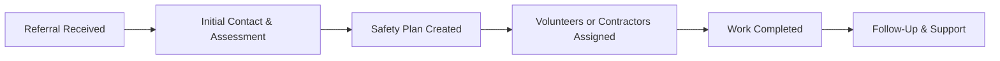

# 🏠 Safe Steps Aotearoa

> *Small steps. Big difference.*

**Safe Steps Aotearoa** is a community-led charity dedicated to improving home safety and accessibility for vulnerable people across Aotearoa New Zealand. We reduce preventable hazards, improve emergency access, and support independent living for those who need it most.

---

## 🌟 The Problem

Every day across Aotearoa, people are injured not because of what happens inside their homes, but because of what happens on the way to the front door.

- **Slippery steps** covered in moss and mould
- **Poor outdoor lighting** leading to falls at night
- **Overgrown pathways** blocking safe access
- **Missing house numbers** delaying emergency responders
- **Cluttered entrances** creating trip hazards

For many—especially older adults, disabled individuals, and those facing financial hardship—these hazards are simply too difficult to fix alone. Some feel embarrassed to ask for help. Others don't know where to turn.

These small issues create big risks: **falls, injuries, delayed emergency care, and loss of independence.**

---

## ✨ Our Solution

Safe Steps Aotearoa provides **practical, targeted home safety improvements** through a hybrid model:

### 🙌 Volunteer Support
Community volunteers help with:
- Clearing pathways and entrances
- Light garden tidying
- Installing reflective house numbers
- Replacing outdoor light bulbs
- Simple hazard removal

### 🔧 Trusted Contractors
Skilled tradespeople handle:
- Pressure washing slippery surfaces
- Installing outdoor lighting
- Pathway repairs (non-structural)
- Heavy vegetation removal
- Anti-slip treatments

Contractors work at **discounted rates or donate services** to keep costs low and maximize community impact.

---

## 🎯 Our Mission

**To support vulnerable New Zealanders by creating safer, more accessible home environments—reducing preventable harm and empowering people to remain independent, confident, and connected in their own homes.**

---

## 💚 Core Values

- **🤝 Manaakitanga** – We treat every person with dignity, care, and respect
- **🛡️ Prevention First** – Small improvements prevent serious harm
- **⚖️ Equity & Access** – Everyone deserves a safe home
- **🌏 Community Connection** – Neighbors helping neighbors
- **✅ Integrity & Trust** – Transparent, accountable, ethical

---

## 📋 Services We Provide

| Service | Description |
|---------|-------------|
| **Home Safety Assessments** | Free, friendly assessments identifying outdoor hazards |
| **Pathway & Access Improvements** | Clearing overgrown vegetation, debris, and trip hazards |
| **Slippery Surface Treatment** | Pressure washing, anti-slip solutions for decks/paths |
| **Lighting & Visibility** | Installing/improving outdoor lighting for safety |
| **House Numbering** | Clear, reflective numbering for emergency access |
| **Garden Maintenance** | One-off support for those unable to maintain access |
| **Coordination & Referrals** | Connecting clients with contractors and community services |

---

## 🚀 How It Works

1. **Referral** – From health professionals, community workers, whānau, or self-referral
2. **Assessment** – Trained volunteer conducts a friendly home safety check
3. **Plan** – Simple, clear action plan created with client input
4. **Delivery** – Volunteers or contractors complete the work safely
5. **Follow-Up** – Check-in to ensure lasting safety and satisfaction

---

## 🏥 Who We Support

Our services are designed for vulnerable residents, including:

- 👵 **Older adults** with limited mobility
- ♿ **Disabled individuals** facing physical barriers
- 🏠 **People living alone** without nearby support
- 💰 **Those experiencing financial hardship**
- 🩺 **Individuals recovering from illness or injury**
- 🌐 **Socially isolated residents**

---

## 🗺️ Where We Operate

**Currently serving: Hamilton City & Wider Waikato Region**

We're starting local and building strong foundations before expanding across Aotearoa.

---

## 📞 How to Get Involved

### 🙋 Volunteer
Join our community team and help make homes safer for your neighbors.

### 💼 Partner With Us
Are you a contractor, hardware supplier, or community organization? Let's work together.

### 💝 Donate
Support our work through funding, materials, or services.

### 📢 Refer Someone
Know someone who could benefit? Health professionals, social workers, and community members can refer clients to us.

---

## 🧑‍⚕️ About the Founder

**Cameron New** is a paramedic who has responded to countless emergencies across Aotearoa. Time and again, Cameron witnessed how outdoor hazards—slippery paths, poor lighting, hidden house numbers—contributed to preventable injuries and delayed emergency care.

Motivated by these experiences, Cameron founded **Safe Steps Aotearoa** to address the gap between health needs and practical home safety support.

---

## 🤝 Our Partners

*We're currently building partnerships with:*
- Health & emergency services
- Community organizations
- Local councils
- Trades & hardware suppliers
- Funding bodies

Interested in partnering? [Get in touch](#)

---

## 📊 Impact

*As we launch our services, we'll track:*

- 🏡 Homes made safer
- 🚑 Emergency access improved
- ⚠️ Hazards removed
- 🤕 Falls prevented
- 💪 People empowered to live independently

---

## 📄 Legal & Governance

Safe Steps Aotearoa is established as an **Incorporated Charitable Trust** under New Zealand law.

- **Trustees:** Cameron New, Jade Morris, Aakash Shah
- **Registration:** Charities Services (pending)
- **Compliance:** Trusts Act 2019, Health & Safety at Work Act 2015

---

## 📜 License

This project is licensed under the **MIT License** - see the [LICENSE](LICENSE) file for details.

We believe in open collaboration for community good.

---

## 📬 Contact

**Email:** [Coming soon]
**Website:** [Coming soon]
**Location:** Hamilton, Waikato, New Zealand 🇳🇿

---

## ⭐ Support This Project

If you believe everyone deserves a safe home, consider:

- ⭐ **Starring this repo** to show your support
- 🔄 **Sharing** with your networks
- 💬 **Getting involved** as a volunteer or partner

---

**Together, we're building safer homes and stronger communities across Aotearoa.**

*Small steps. Big difference.* 🌿
